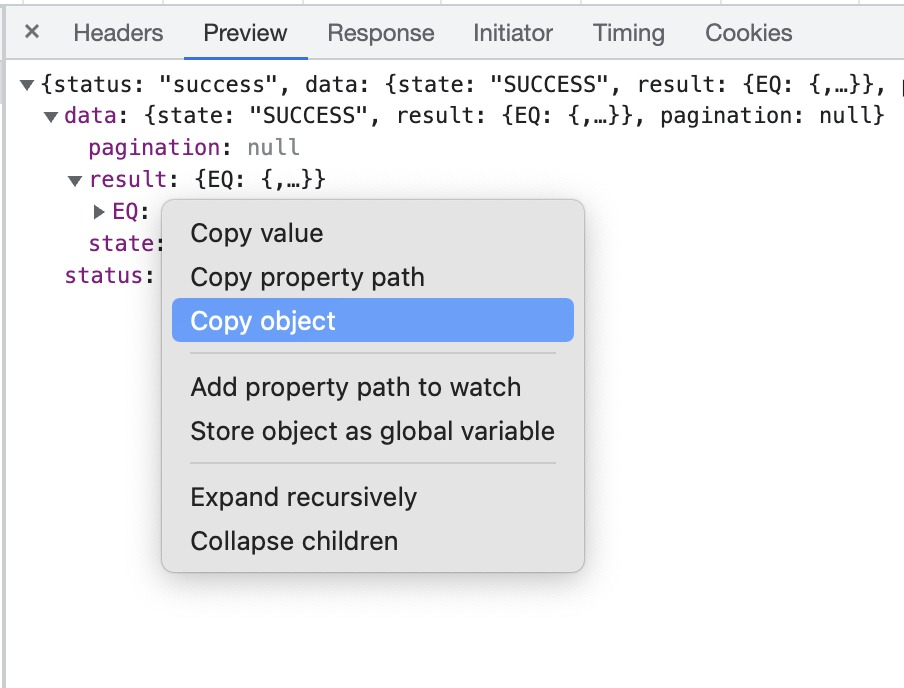

# Boori

Boori helps you keep track of your net-worth on a daily basis. It parses any bank statements, account value curves in case of demat accounts etc and outputs an Excel file that you can keep importing into Google Sheets or any other processor of your choice. By default, it also outputs a column '5-day trailing median net-worth' so that you don't see random spikes in the graph (say your friend transfers you some money that you return back immediately). This 5-day trailing median would be a better representative of your net worth over time.

## Connectors (Value Source Hubs)

We code 'value source hubs' - a fancy name for any financial institution - so that we can parse whatever they output. For example, HDFC Bank would be a value source hub, and we can parse its bank statements that can be generated using Netbanking.

We support the following Value Source Hubs currently:

- [HDFC](https://www.hdfcbank.com/) (Banking)
- [Zerodha](https://zerodha.com/) (Stock Broker)
- [Jupiter](https://jupiter.money/) (Banking, Federal Bank)

## How to use?

Create a `boori.json` at the project root. You can follow the format that is in [example-boori.json](example-boori.json).

You can place the input data in a convenient location. For your convenience, `PROJECT_ROOT/input` folder has been gitignored - you can place your input data there if you wish.

For generating the input data:

### HDFC

Go to NetBanking and generate your account statement in 'Excel' format. You can generate multiple statements and put it in a folder to use, or a single statement to use, as mentioned in [example-boori.json](example-boori.json).

### Zerodha

This is slightly trickier.

1. Go to your [Zerodha Console](https://console.zerodha.com).
1. Login with Kite.
1. Open 'Networks' tab in Developer Tools (Inspect Element).
1. Click on 'View account value curve'.
1. You will see a request going to an API `account_values`. See the 'Preview' tab of that request, and Copy the object under `data > pagination > result > EQ`.
   
1. Paste this object into a JSON file, and use the file URL of this file as the `url` param in your `boori.json`.

### Jupiter

1. Open Jupiter app > Recent Transactions > See all.
1. At the top right, you will see a document icon and a pie-chart icon. Click the document icon.
1. You can use this screen to request your bank statements to be delivered to your registered email. Note that Annual statements are available only until the previous FY. For the current FY, you need to come to this screen and request for each month.
1. Download all your bank statement PDFs and put them in a folder. This folder file URL should be pasted as the `url` key in your `boori.json`.
1. For Jupiter, you also have to mention your password in the key `password` as mentioned in [example-boori.json](example-boori.json). By default, the password format is _First 4 letters of your first name_ + _Your birth day in DD format_ + _Your birth month in MM format_. For example, if your name is Rajesh Koothrappalli, and you were born on January 9th, 1970, then your password would be `RAJE0901`.

## How to contribute?

- Help us by contributing more Value Source Hubs (Connectors)! This project becomes valuable to everyone as it gets more Value Source Hubs.
- Create issues for bugs and feature requests that can improve the impact of this project (even if it increases the scope).

## What is the meaning of 'Boori'?

1. It is an Indian deep-fried dish made with flour. Here's the [wikipedia page](https://upload.wikimedia.org/wikipedia/commons/thumb/3/33/Fluffy_Poori.JPG/1024px-Fluffy_Poori.JPG).

   .

1. It is an inside joke among a couple of friends referring to a friend.
